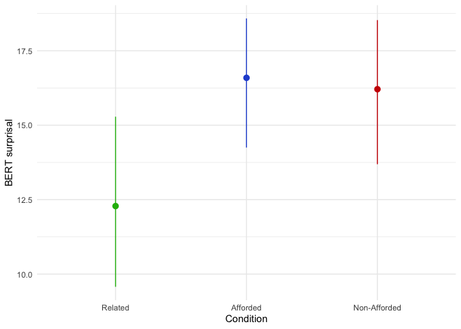
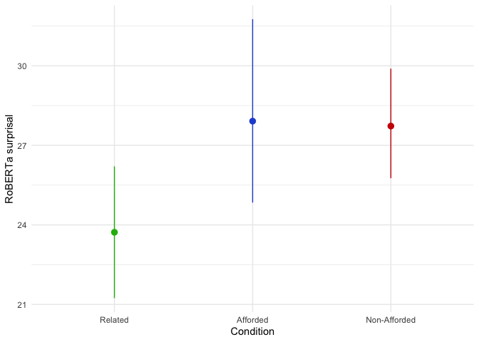
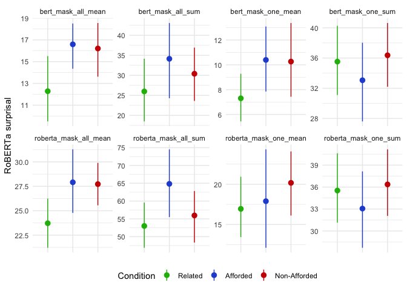
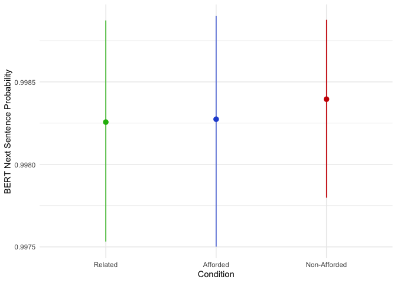
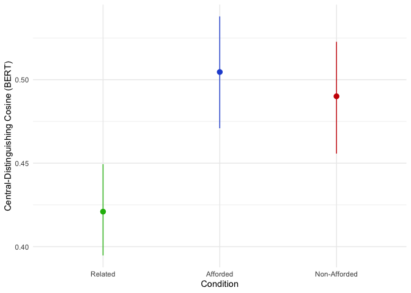
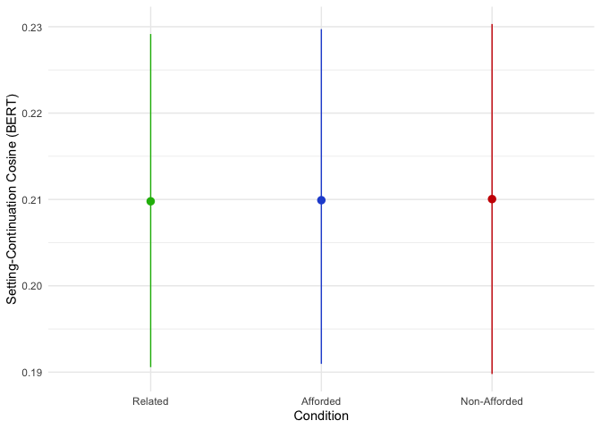

Setup
=====

``` r
# Load packages
suppressMessages(library(tidyverse))
suppressMessages(library(lmerTest))
```

Summary of the data:

``` r
# Load and peek data
stimuli <- read.csv("../data/clean/stimuli_analysed.csv")

# Code condition as factor
stimuli$condition <- recode(stimuli$condition,
                            afforded = "Afforded",
                            nonafforded = "Non-Afforded",
                            related = "Related")

stimuli$condition <- factor(stimuli$condition, levels=c("Related", "Afforded", "Non-Afforded"))

# Analyse e1 and e2 separately
e1 <- stimuli %>% filter(experiment == 1)
e2 <- stimuli %>% filter(experiment == 2)

summary(stimuli)
```

    ##    experiment         item           object            version         
    ##  Min.   :1.000   Min.   : 1.000   Length:122         Length:122        
    ##  1st Qu.:1.000   1st Qu.: 5.000   Class :character   Class :character  
    ##  Median :2.000   Median : 9.000   Mode  :character   Mode  :character  
    ##  Mean   :1.557   Mean   : 9.221                                        
    ##  3rd Qu.:2.000   3rd Qu.:13.750                                        
    ##  Max.   :2.000   Max.   :18.000                                        
    ##                                                                        
    ##         condition    setting            critical         central_word      
    ##  Related     :18   Length:122         Length:122         Length:122        
    ##  Afforded    :52   Class :character   Class :character   Class :character  
    ##  Non-Afforded:52   Mode  :character   Mode  :character   Mode  :character  
    ##                                                                            
    ##                                                                            
    ##                                                                            
    ##                                                                            
    ##  distinguishing_word    notes           key.inference      critical_masked   
    ##  Length:122          Length:122         Length:122         Length:122        
    ##  Class :character    Class :character   Class :character   Class :character  
    ##  Mode  :character    Mode  :character   Mode  :character   Mode  :character  
    ##                                                                              
    ##                                                                              
    ##                                                                              
    ##                                                                              
    ##  full_masked        bert_mask_all_mean bert_mask_one_mean bert_mask_all_sum
    ##  Length:122         Min.   : 2.112     Min.   : 0.04359   Min.   : 3.393   
    ##  Class :character   1st Qu.: 8.075     1st Qu.: 3.53058   1st Qu.:13.763   
    ##  Mode  :character   Median :13.275     Median : 6.92975   Median :25.502   
    ##                     Mean   :13.439     Mean   : 7.32767   Mean   :29.320   
    ##                     3rd Qu.:18.393     3rd Qu.: 9.31285   3rd Qu.:39.954   
    ##                     Max.   :28.882     Max.   :25.43559   Max.   :92.956   
    ##                                                                            
    ##  bert_mask_one_sum roberta_mask_all_mean roberta_mask_one_mean
    ##  Min.   :11.83     Min.   :11.47         Min.   : 2.562       
    ##  1st Qu.:27.26     1st Qu.:19.34         1st Qu.:10.017       
    ##  Median :32.41     Median :22.84         Median :13.053       
    ##  Mean   :33.42     Mean   :23.25         Mean   :15.075       
    ##  3rd Qu.:38.55     3rd Qu.:26.02         3rd Qu.:18.438       
    ##  Max.   :61.31     Max.   :48.65         Max.   :48.652       
    ##                                                               
    ##  roberta_mask_all_sum roberta_mask_one_sum    bert_nsp      cd_cosine_bert_ln2
    ##  Min.   : 22.94       Min.   :11.83        Min.   :0.9837   Min.   :0.1337    
    ##  1st Qu.: 45.88       1st Qu.:27.26        1st Qu.:0.9973   1st Qu.:0.3984    
    ##  Median : 57.83       Median :32.41        Median :0.9987   Median :0.4730    
    ##  Mean   : 58.20       Mean   :33.42        Mean   :0.9978   Mean   :0.4598    
    ##  3rd Qu.: 69.12       3rd Qu.:38.55        3rd Qu.:0.9992   3rd Qu.:0.5294    
    ##  Max.   :107.53       Max.   :61.31        Max.   :0.9997   Max.   :0.6160    
    ##                                                             NA's   :66        
    ##  sc_cosine_bert_ln2
    ##  Min.   :0.1461    
    ##  1st Qu.:0.2018    
    ##  Median :0.2475    
    ##  Mean   :0.2567    
    ##  3rd Qu.:0.3104    
    ##  Max.   :0.3975    
    ## 

Masked Surprisal of Distinguishing Words
========================================

The first measure is the masked probability of the distinguishing word
in the critical sentence.

In item 13, for example, we find the surprisal for each distinguishing
word {leaves, water, clothes} in the sentence:

> Marissa forgot to bring her pillow on her camping trip. As a
> substitute for her pillow, she filled up an old sweater with \[MASK\].

I’ve run all of the examples through BERT (base, uncased) and RoBERTA
(base).

``` r
e1 %>%
  ggplot(aes(x = condition, y = bert_mask_all_mean, color=condition)) +
  stat_summary(fun.data="mean_cl_boot", geom="pointrange") + 
  theme_minimal() + 
  theme(
    legend.position = "none"
  ) +
  scale_color_manual("Condition",
     values = c("#1eb809", "#2654d4", "#cc0502")) + 
  labs(
    y = "BERT surprisal",
    x = "Condition"
  )
```



``` r
e1 %>%
  ggplot(aes(x = condition, y = roberta_mask_all_mean, color=condition)) +
  stat_summary(fun.data="mean_cl_boot", geom="pointrange") + 
  theme_minimal() + 
  theme(
    legend.position = "none"
  ) +
  scale_color_manual("Condition",
     values = c("#1eb809", "#2654d4", "#cc0502")) + 
  labs(
    y = "RoBERTa surprisal",
    x = "Condition"
  )
```



Predictions from both models show a clear gap in surprisal between
Related and Afforded/Non-Afforded, but no clear distinction between
Afforded and Non-Afforded stimuli (suggesting that the models are not
sensitive to the afforded manipulation).

Models
------

To compare surprisal between conditions I created two different models:
one to compare Afforded to Related, and one to compare Non-Afforded to
Afforded.

### Related vs Afforded

In both models I added a random intercept by item. I wanted to add a
random slope (to control for the fact that there might variable
influence of the manipulation on surprisal across items) but there are
too few data points.

The model summary (using `lmerTest` to get degrees of freedom) shows a
significant positive effect of Afforded vs Related on BERT surprisal.

``` r
# Comparison 1: Afforded to related
e1.aff.rel <- e1 %>% filter(condition %in% c("Afforded", "Related"))

m.aff.rel.bert.base <- lmer("bert_mask_all_mean ~ 1 + (1 | item)",
                            data=e1.aff.rel,
                            REML = F)
m.aff.rel.bert.full <- lmer("bert_mask_all_mean ~ condition + (1 | item)",
                            data=e1.aff.rel,
                            REML = F)

summary(m.aff.rel.bert.full)
```

    ## Linear mixed model fit by maximum likelihood . t-tests use Satterthwaite's
    ##   method [lmerModLmerTest]
    ## Formula: "bert_mask_all_mean ~ condition + (1 | item)"
    ##    Data: e1.aff.rel
    ## 
    ##      AIC      BIC   logLik deviance df.resid 
    ##    233.1    239.5   -112.6    225.1       32 
    ## 
    ## Scaled residuals: 
    ##      Min       1Q   Median       3Q      Max 
    ## -1.60889 -0.55030  0.01381  0.50320  2.60119 
    ## 
    ## Random effects:
    ##  Groups   Name        Variance Std.Dev.
    ##  item     (Intercept)  9.754   3.123   
    ##  Residual             22.224   4.714   
    ## Number of obs: 36, groups:  item, 18
    ## 
    ## Fixed effects:
    ##                   Estimate Std. Error     df t value Pr(>|t|)    
    ## (Intercept)         12.284      1.333 32.936   9.216 1.22e-10 ***
    ## conditionAfforded    4.307      1.571 18.000   2.741   0.0134 *  
    ## ---
    ## Signif. codes:  0 '***' 0.001 '**' 0.01 '*' 0.05 '.' 0.1 ' ' 1
    ## 
    ## Correlation of Fixed Effects:
    ##             (Intr)
    ## cndtnAffrdd -0.589

An LRT also finds a significant improvement in fit for adding condition
info.

``` r
anova(m.aff.rel.bert.base, m.aff.rel.bert.full)
```

    ## Data: e1.aff.rel
    ## Models:
    ## m.aff.rel.bert.base: "bert_mask_all_mean ~ 1 + (1 | item)"
    ## m.aff.rel.bert.full: "bert_mask_all_mean ~ condition + (1 | item)"
    ##                     npar    AIC    BIC  logLik deviance  Chisq Df Pr(>Chisq)  
    ## m.aff.rel.bert.base    3 237.43 242.18 -115.71   231.43                       
    ## m.aff.rel.bert.full    4 233.15 239.48 -112.57   225.15 6.2781  1    0.01222 *
    ## ---
    ## Signif. codes:  0 '***' 0.001 '**' 0.01 '*' 0.05 '.' 0.1 ' ' 1

We see the same pattern of results with RoBERTa.

``` r
# RoBERTa

m.aff.rel.roberta.base <- lmer("roberta_mask_all_mean ~ 1 + (1 | item)",
                            data=e1.aff.rel,
                            REML = F)
m.aff.rel.roberta.full <- lmer("roberta_mask_all_mean ~ condition + (1 | item)",
                            data=e1.aff.rel,
                            REML = F)

summary(m.aff.rel.roberta.full)
```

    ## Linear mixed model fit by maximum likelihood . t-tests use Satterthwaite's
    ##   method [lmerModLmerTest]
    ## Formula: "roberta_mask_all_mean ~ condition + (1 | item)"
    ##    Data: e1.aff.rel
    ## 
    ##      AIC      BIC   logLik deviance df.resid 
    ##    239.7    246.0   -115.9    231.7       32 
    ## 
    ## Scaled residuals: 
    ##     Min      1Q  Median      3Q     Max 
    ## -1.3030 -0.4732 -0.2704  0.3934  2.5836 
    ## 
    ## Random effects:
    ##  Groups   Name        Variance Std.Dev.
    ##  item     (Intercept) 19.45    4.410   
    ##  Residual             21.95    4.685   
    ## Number of obs: 36, groups:  item, 18
    ## 
    ## Fixed effects:
    ##                   Estimate Std. Error     df t value Pr(>|t|)    
    ## (Intercept)         23.721      1.517 29.489  15.642 8.11e-16 ***
    ## conditionAfforded    4.191      1.562 18.000   2.684   0.0152 *  
    ## ---
    ## Signif. codes:  0 '***' 0.001 '**' 0.01 '*' 0.05 '.' 0.1 ' ' 1
    ## 
    ## Correlation of Fixed Effects:
    ##             (Intr)
    ## cndtnAffrdd -0.515

``` r
anova(m.aff.rel.roberta.base, m.aff.rel.roberta.full)
```

    ## Data: e1.aff.rel
    ## Models:
    ## m.aff.rel.roberta.base: "roberta_mask_all_mean ~ 1 + (1 | item)"
    ## m.aff.rel.roberta.full: "roberta_mask_all_mean ~ condition + (1 | item)"
    ##                        npar    AIC    BIC  logLik deviance  Chisq Df Pr(>Chisq)
    ## m.aff.rel.roberta.base    3 243.77 248.52 -118.88   237.77                     
    ## m.aff.rel.roberta.full    4 239.71 246.04 -115.86   231.71 6.0578  1    0.01385
    ##                         
    ## m.aff.rel.roberta.base  
    ## m.aff.rel.roberta.full *
    ## ---
    ## Signif. codes:  0 '***' 0.001 '**' 0.01 '*' 0.05 '.' 0.1 ' ' 1

### Afforded vs Non-Afforded

The lmerTest summary shows no significant effect on BERT surprisal for
the Afforded/Non-Afforded distinction.

``` r
# Comparison 2: Afforded to Non-Afforded
e1.aff.naff <- e1 %>% filter(condition %in% c("Afforded", "Non-Afforded"))

m.aff.naff.bert.base <- lmer("bert_mask_all_mean ~ 1 + (1 | item)",
                            data=e1.aff.naff,
                            REML = F)
m.aff.naff.bert.full <- lmer("bert_mask_all_mean ~ condition + (1 | item)",
                            data=e1.aff.naff,
                            REML = F)

summary(m.aff.naff.bert.full)
```

    ## Linear mixed model fit by maximum likelihood . t-tests use Satterthwaite's
    ##   method [lmerModLmerTest]
    ## Formula: "bert_mask_all_mean ~ condition + (1 | item)"
    ##    Data: e1.aff.naff
    ## 
    ##      AIC      BIC   logLik deviance df.resid 
    ##    224.5    230.8   -108.2    216.5       32 
    ## 
    ## Scaled residuals: 
    ##     Min      1Q  Median      3Q     Max 
    ## -2.3138 -0.4972  0.2210  0.4830  2.0838 
    ## 
    ## Random effects:
    ##  Groups   Name        Variance Std.Dev.
    ##  item     (Intercept)  4.339   2.083   
    ##  Residual             19.983   4.470   
    ## Number of obs: 36, groups:  item, 18
    ## 
    ## Fixed effects:
    ##                       Estimate Std. Error      df t value Pr(>|t|)    
    ## (Intercept)            16.5911     1.1624 34.8897  14.273 3.92e-16 ***
    ## conditionNon-Afforded  -0.3825     1.4901 18.0000  -0.257      0.8    
    ## ---
    ## Signif. codes:  0 '***' 0.001 '**' 0.01 '*' 0.05 '.' 0.1 ' ' 1
    ## 
    ## Correlation of Fixed Effects:
    ##             (Intr)
    ## cndtnNn-Aff -0.641

Neither does an LRT.

``` r
anova(m.aff.naff.bert.base, m.aff.naff.bert.full)
```

    ## Data: e1.aff.naff
    ## Models:
    ## m.aff.naff.bert.base: "bert_mask_all_mean ~ 1 + (1 | item)"
    ## m.aff.naff.bert.full: "bert_mask_all_mean ~ condition + (1 | item)"
    ##                      npar    AIC    BIC  logLik deviance  Chisq Df Pr(>Chisq)
    ## m.aff.naff.bert.base    3 222.54 227.29 -108.27   216.54                     
    ## m.aff.naff.bert.full    4 224.47 230.80 -108.23   216.47 0.0658  1     0.7976

Nor RoBERTa

``` r
# RoBERTa

m.aff.naff.roberta.base <- lmer("roberta_mask_all_mean ~ 1 + (1 | item)",
                            data=e1.aff.naff,
                            REML = F)
m.aff.naff.roberta.full <- lmer("roberta_mask_all_mean ~ condition + (1 | item)",
                            data=e1.aff.naff,
                            REML = F)

summary(m.aff.naff.roberta.full)
```

    ## Linear mixed model fit by maximum likelihood . t-tests use Satterthwaite's
    ##   method [lmerModLmerTest]
    ## Formula: "roberta_mask_all_mean ~ condition + (1 | item)"
    ##    Data: e1.aff.naff
    ## 
    ##      AIC      BIC   logLik deviance df.resid 
    ##    238.9    245.3   -115.5    230.9       32 
    ## 
    ## Scaled residuals: 
    ##     Min      1Q  Median      3Q     Max 
    ## -1.0649 -0.6602 -0.1510  0.3079  3.1228 
    ## 
    ## Random effects:
    ##  Groups   Name        Variance Std.Dev.
    ##  item     (Intercept)  8.33    2.886   
    ##  Residual             28.39    5.329   
    ## Number of obs: 36, groups:  item, 18
    ## 
    ## Fixed effects:
    ##                       Estimate Std. Error      df t value Pr(>|t|)    
    ## (Intercept)            27.9118     1.4284 34.2383  19.541   <2e-16 ***
    ## conditionNon-Afforded  -0.1858     1.7762 18.0000  -0.105    0.918    
    ## ---
    ## Signif. codes:  0 '***' 0.001 '**' 0.01 '*' 0.05 '.' 0.1 ' ' 1
    ## 
    ## Correlation of Fixed Effects:
    ##             (Intr)
    ## cndtnNn-Aff -0.622

``` r
anova(m.aff.naff.roberta.base, m.aff.naff.roberta.full)
```

    ## Data: e1.aff.naff
    ## Models:
    ## m.aff.naff.roberta.base: "roberta_mask_all_mean ~ 1 + (1 | item)"
    ## m.aff.naff.roberta.full: "roberta_mask_all_mean ~ condition + (1 | item)"
    ##                         npar    AIC    BIC  logLik deviance  Chisq Df
    ## m.aff.naff.roberta.base    3 236.95 241.70 -115.47   230.95          
    ## m.aff.naff.roberta.full    4 238.94 245.27 -115.47   230.94 0.0109  1
    ##                         Pr(>Chisq)
    ## m.aff.naff.roberta.base           
    ## m.aff.naff.roberta.full     0.9167

Overall the results suggest that models are sensitive to the
Related/Afforded distinction (lower surprisal for Related); but not
sensitive to the affordances of non-related concepts.

Multi-token mask aggregation methods
------------------------------------

Some of the distinguishing concepts have multiple words (or tokens).
There are different possible approaches to elicit probabilities for
multi-word phrases. The one I’ve used above as a default (from [Kocijan
et al., 2019](https://arxiv.org/abs/1905.06290)) is to:

1.  Generate a mask token for each token in the masked phrase.
2.  Find the surprisal for each token
3.  Find the mean of the token surprisals

This seemed arbitrary to me and so I wanted to try some other
aggregation methods:

1.  Summing instead of taking the mean of token surprisal (as this seems
    closer to total surprisal)
2.  Only masking one token at a time (to prevent penalising phrases
    where the tokens are individually very unlikely, but much more
    likely when conditioned on one another)

This creates 4 different approaches for each model `sum` vs `log` and
`mask_all` (default) vs `mask_one` (new). Varying this method changes
the results quite dramatically:

``` r
e1.mask.pivot <- e1 %>%
  select(experiment, item, condition, contains("_mask_")) %>%
  pivot_longer(cols=contains("_mask_"), names_to="measure", values_to="surprisal")

e1.mask.pivot %>%
  ggplot(aes(x = condition, y = surprisal, color=condition)) +
  facet_wrap(vars(measure), nrow=2, scales="free_y") +
  stat_summary(fun.data="mean_cl_boot", geom="pointrange") + 
  theme_minimal() +
  theme(
    legend.position = "bottom",
    axis.text.x = element_blank(),
    axis.title.x = element_blank()
  ) +
  scale_color_manual("Condition",
     values = c("#1eb809", "#2654d4", "#cc0502")) + 
  labs(
    y = "RoBERTa surprisal",
    x = "Condition"
  )
```



In hindsight I think the original `mask_all_mean` method is the best
motivated. Summing surprisals leads to higher surprisal for phrases
which have more tokens (which doesn’t make any sense here). Masking one
token at a time probably leads to underestimating surprisal for phrases
with multiple tokens that have much higher conditional probability (as
the model never has to estimate the likelihood of any of the tokens in
the absence of the others).

Next Sentence Prediction
========================

The next method I tried was to get BERT to predict whether the critical
sentence followed from the setting sentence. BERT produces two
activation values (one for `not continuation`, one for `continuation`).
From what I’ve read, BERT’s prediction is taken to be negative if the
second value is higher than the first (and vice versa).

In order to elicit probabilities from these activation values, I just
used softmax (which I don’t think works very well with so few values,
often the values are e.g. (6, -6)). In general the probabilities are all
very high and don’t show much variation.

If anything Non-Afforded continuations show a slightly higher
probability than Afforded and Related continuations.

``` r
e1 %>%
  ggplot(aes(x = condition, y = bert_nsp, color=condition)) +
  stat_summary(fun.data="mean_cl_boot", geom="pointrange") + 
  theme_minimal() + 
  theme(
    legend.position = "none"
  ) +
  scale_color_manual("Condition",
     values = c("#1eb809", "#2654d4", "#cc0502")) + 
  labs(
    y = "BERT Next Sentence Probability",
    x = "Condition"
  )
```



Models show no difference of condition for either comparison

``` r
# RoBERTa

m.aff.rel.bert.nsp.base <- lmer("bert_nsp ~ 1 + (1 | item)",
                            data=e1.aff.rel,
                            REML = F)
m.aff.rel.bert.nsp.full <- lmer("bert_nsp ~ condition + (1 | item)",
                            data=e1.aff.rel,
                            REML = F)

summary(m.aff.rel.bert.nsp.full)
```

    ## Linear mixed model fit by maximum likelihood . t-tests use Satterthwaite's
    ##   method [lmerModLmerTest]
    ## Formula: "bert_nsp ~ condition + (1 | item)"
    ##    Data: e1.aff.rel
    ## 
    ##      AIC      BIC   logLik deviance df.resid 
    ##   -388.3   -382.0    198.2   -396.3       32 
    ## 
    ## Scaled residuals: 
    ##      Min       1Q   Median       3Q      Max 
    ## -2.34961 -0.10866  0.08612  0.26237  2.08997 
    ## 
    ## Random effects:
    ##  Groups   Name        Variance  Std.Dev. 
    ##  item     (Intercept) 1.978e-06 0.0014063
    ##  Residual             2.248e-07 0.0004741
    ## Number of obs: 36, groups:  item, 18
    ## 
    ## Fixed effects:
    ##                    Estimate Std. Error        df  t value Pr(>|t|)    
    ## (Intercept)       9.983e-01  3.498e-04 1.993e+01 2853.800   <2e-16 ***
    ## conditionAfforded 1.754e-05  1.580e-04 1.800e+01    0.111    0.913    
    ## ---
    ## Signif. codes:  0 '***' 0.001 '**' 0.01 '*' 0.05 '.' 0.1 ' ' 1
    ## 
    ## Correlation of Fixed Effects:
    ##             (Intr)
    ## cndtnAffrdd -0.226

``` r
anova(m.aff.rel.bert.nsp.base, m.aff.rel.bert.nsp.full)
```

    ## Data: e1.aff.rel
    ## Models:
    ## m.aff.rel.bert.nsp.base: "bert_nsp ~ 1 + (1 | item)"
    ## m.aff.rel.bert.nsp.full: "bert_nsp ~ condition + (1 | item)"
    ##                         npar     AIC     BIC logLik deviance  Chisq Df
    ## m.aff.rel.bert.nsp.base    3 -390.30 -385.55 198.15  -396.30          
    ## m.aff.rel.bert.nsp.full    4 -388.32 -381.98 198.16  -396.32 0.0123  1
    ##                         Pr(>Chisq)
    ## m.aff.rel.bert.nsp.base           
    ## m.aff.rel.bert.nsp.full     0.9116

``` r
# RoBERTa

m.aff.naff.bert.nsp.base <- lmer("bert_nsp ~ 1 + (1 | item)",
                            data=e1.aff.naff,
                            REML = F)
m.aff.naff.bert.nsp.full <- lmer("bert_nsp ~ condition + (1 | item)",
                            data=e1.aff.naff,
                            REML = F)

summary(m.aff.naff.bert.nsp.full)
```

    ## Linear mixed model fit by maximum likelihood . t-tests use Satterthwaite's
    ##   method [lmerModLmerTest]
    ## Formula: "bert_nsp ~ condition + (1 | item)"
    ##    Data: e1.aff.naff
    ## 
    ##      AIC      BIC   logLik deviance df.resid 
    ##   -401.8   -395.5    204.9   -409.8       32 
    ## 
    ## Scaled residuals: 
    ##      Min       1Q   Median       3Q      Max 
    ## -2.35230 -0.13203  0.03744  0.28103  1.56344 
    ## 
    ## Random effects:
    ##  Groups   Name        Variance  Std.Dev. 
    ##  item     (Intercept) 1.702e-06 0.0013047
    ##  Residual             1.259e-07 0.0003548
    ## Number of obs: 36, groups:  item, 18
    ## 
    ## Fixed effects:
    ##                        Estimate Std. Error        df  t value Pr(>|t|)    
    ## (Intercept)           9.983e-01  3.187e-04 1.928e+01 3132.494   <2e-16 ***
    ## conditionNon-Afforded 1.214e-04  1.183e-04 1.800e+01    1.027    0.318    
    ## ---
    ## Signif. codes:  0 '***' 0.001 '**' 0.01 '*' 0.05 '.' 0.1 ' ' 1
    ## 
    ## Correlation of Fixed Effects:
    ##             (Intr)
    ## cndtnNn-Aff -0.186

``` r
anova(m.aff.naff.bert.nsp.base, m.aff.naff.bert.nsp.full)
```

    ## Data: e1.aff.naff
    ## Models:
    ## m.aff.naff.bert.nsp.base: "bert_nsp ~ 1 + (1 | item)"
    ## m.aff.naff.bert.nsp.full: "bert_nsp ~ condition + (1 | item)"
    ##                          npar     AIC     BIC logLik deviance  Chisq Df
    ## m.aff.naff.bert.nsp.base    3 -402.77 -398.02 204.38  -408.77          
    ## m.aff.naff.bert.nsp.full    4 -401.79 -395.46 204.90  -409.79 1.0243  1
    ##                          Pr(>Chisq)
    ## m.aff.naff.bert.nsp.base           
    ## m.aff.naff.bert.nsp.full     0.3115

Overall I think this metric just isn’t sensitive enough to get at the
relatively small manipulation we are interested in. The lack of effect
for Related-Afforded means it doesn’t seem appropriate to use this
metric to test for an effect of Afforded/Non-Afforded.

Embeddings
==========

The last method, closest to the controls in the original paper, is to
find the distance between the embeddings of:

1.  The central and distinguishing words in a sentence
2.  The setting and critical sentences

The stimuli did not contain information about the central concept, we
used the example in the paper to re-create our best guess for what the
central concept is.

For example, in Item 13, we use “pillow”, and find the cosine between
the contextualised embedding for “pillow” and “leaves”.

> Marissa forgot to bring her pillow on her camping trip. As a
> substitute for her pillow, she filled up an old sweater with leaves.

Where the central or distinguishing phrase is multi-token, we take the
mean of the embedding for all tokens. To find the embedding for the
sentences, we take the mean of all tokens in the sentence (following
this
[tutorial](https://mccormickml.com/2019/05/14/BERT-word-embeddings-tutorial/#3-extracting-embeddings),
thanks Sean for sending!). We could also try using the \[CLS\] token).

For all embeddings, I have used the second-to-last layer of BERT. It
seems to perform
[comparably](https://jalammar.github.io/illustrated-bert/#bert-for-feature-extraction)
with more complex strategies.

In all cases, I’ve taken the cosine distance between the two resulting
vectors.

Central-Distinguishing
----------------------

For the central-distinguishing embedding, we see a similar pattern to
the mask results above: the distance for related continuations is lower
than for Afforded and Non-Afforded continuations, which are comparable.

``` r
e1 %>%
  ggplot(aes(x = condition, y = cd_cosine_bert_ln2, color=condition)) +
  stat_summary(fun.data="mean_cl_boot", geom="pointrange") + 
  theme_minimal() + 
  theme(
    legend.position = "none"
  ) +
  scale_color_manual("Condition",
     values = c("#1eb809", "#2654d4", "#cc0502")) + 
  labs(
    y = "Central-Distinguishing Cosine (BERT)",
    x = "Condition"
  )
```



### Related vs Afforded

The model shows a significant positive effect of Afforded vs Related on
cosine distance.

``` r
# Comparison 1: Afforded to related
m.aff.rel.cd_cosine_bert_ln2.base <- lmer("cd_cosine_bert_ln2 ~ 1 + (1 | item)",
                            data=e1.aff.rel,
                            REML = F)
```

    ## boundary (singular) fit: see ?isSingular

``` r
m.aff.rel.cd_cosine_bert_ln2.full <- lmer("cd_cosine_bert_ln2 ~ condition + (1 | item)",
                            data=e1.aff.rel,
                            REML = F)

summary(m.aff.rel.cd_cosine_bert_ln2.full)
```

    ## Linear mixed model fit by maximum likelihood . t-tests use Satterthwaite's
    ##   method [lmerModLmerTest]
    ## Formula: "cd_cosine_bert_ln2 ~ condition + (1 | item)"
    ##    Data: e1.aff.rel
    ## 
    ##      AIC      BIC   logLik deviance df.resid 
    ##    -87.9    -81.6     48.0    -95.9       32 
    ## 
    ## Scaled residuals: 
    ##      Min       1Q   Median       3Q      Max 
    ## -1.55130 -0.56585 -0.01759  0.42710  1.55397 
    ## 
    ## Random effects:
    ##  Groups   Name        Variance Std.Dev.
    ##  item     (Intercept) 0.001620 0.04025 
    ##  Residual             0.002764 0.05258 
    ## Number of obs: 36, groups:  item, 18
    ## 
    ## Fixed effects:
    ##                   Estimate Std. Error       df t value Pr(>|t|)    
    ## (Intercept)        0.42099    0.01561 31.67615  26.975  < 2e-16 ***
    ## conditionAfforded  0.08361    0.01753 18.00000   4.771 0.000153 ***
    ## ---
    ## Signif. codes:  0 '***' 0.001 '**' 0.01 '*' 0.05 '.' 0.1 ' ' 1
    ## 
    ## Correlation of Fixed Effects:
    ##             (Intr)
    ## cndtnAffrdd -0.561

An LRT also finds a significant improvement in fit for adding condition
info.

``` r
anova(m.aff.rel.cd_cosine_bert_ln2.base, m.aff.rel.cd_cosine_bert_ln2.full)
```

    ## Data: e1.aff.rel
    ## Models:
    ## m.aff.rel.cd_cosine_bert_ln2.base: "cd_cosine_bert_ln2 ~ 1 + (1 | item)"
    ## m.aff.rel.cd_cosine_bert_ln2.full: "cd_cosine_bert_ln2 ~ condition + (1 | item)"
    ##                                   npar     AIC     BIC logLik deviance  Chisq
    ## m.aff.rel.cd_cosine_bert_ln2.base    3 -75.229 -70.479 40.615  -81.229       
    ## m.aff.rel.cd_cosine_bert_ln2.full    4 -87.948 -81.614 47.974  -95.948 14.719
    ##                                   Df Pr(>Chisq)    
    ## m.aff.rel.cd_cosine_bert_ln2.base                  
    ## m.aff.rel.cd_cosine_bert_ln2.full  1  0.0001248 ***
    ## ---
    ## Signif. codes:  0 '***' 0.001 '**' 0.01 '*' 0.05 '.' 0.1 ' ' 1

### Afforded vs Non-Afforded

However we see no significant effect of afforded vs non-afforded

``` r
# Comparison 1: Afforded to related
m.aff.naff.cd_cosine_bert_ln2.base <- lmer("cd_cosine_bert_ln2 ~ 1 + (1 | item)",
                            data=e1.aff.naff,
                            REML = F)
m.aff.naff.cd_cosine_bert_ln2.full <- lmer("cd_cosine_bert_ln2 ~ condition + (1 | item)",
                            data=e1.aff.naff,
                            REML = F)

summary(m.aff.naff.cd_cosine_bert_ln2.full)
```

    ## Linear mixed model fit by maximum likelihood . t-tests use Satterthwaite's
    ##   method [lmerModLmerTest]
    ## Formula: "cd_cosine_bert_ln2 ~ condition + (1 | item)"
    ##    Data: e1.aff.naff
    ## 
    ##      AIC      BIC   logLik deviance df.resid 
    ##    -80.4    -74.0     44.2    -88.4       32 
    ## 
    ## Scaled residuals: 
    ##     Min      1Q  Median      3Q     Max 
    ## -2.0625 -0.4688  0.1188  0.5786  1.3880 
    ## 
    ## Random effects:
    ##  Groups   Name        Variance Std.Dev.
    ##  item     (Intercept) 0.001258 0.03546 
    ##  Residual             0.003928 0.06268 
    ## Number of obs: 36, groups:  item, 18
    ## 
    ## Fixed effects:
    ##                       Estimate Std. Error       df t value Pr(>|t|)    
    ## (Intercept)            0.50460    0.01697 34.00073  29.728   <2e-16 ***
    ## conditionNon-Afforded -0.01455    0.02089 18.00000  -0.696    0.495    
    ## ---
    ## Signif. codes:  0 '***' 0.001 '**' 0.01 '*' 0.05 '.' 0.1 ' ' 1
    ## 
    ## Correlation of Fixed Effects:
    ##             (Intr)
    ## cndtnNn-Aff -0.615

``` r
anova(m.aff.naff.cd_cosine_bert_ln2.base, m.aff.naff.cd_cosine_bert_ln2.full)
```

    ## Data: e1.aff.naff
    ## Models:
    ## m.aff.naff.cd_cosine_bert_ln2.base: "cd_cosine_bert_ln2 ~ 1 + (1 | item)"
    ## m.aff.naff.cd_cosine_bert_ln2.full: "cd_cosine_bert_ln2 ~ condition + (1 | item)"
    ##                                    npar     AIC     BIC logLik deviance  Chisq
    ## m.aff.naff.cd_cosine_bert_ln2.base    3 -81.873 -77.122 43.937  -87.873       
    ## m.aff.naff.cd_cosine_bert_ln2.full    4 -80.351 -74.017 44.176  -88.351 0.4784
    ##                                    Df Pr(>Chisq)
    ## m.aff.naff.cd_cosine_bert_ln2.base              
    ## m.aff.naff.cd_cosine_bert_ln2.full  1     0.4892

Setting-Critical
----------------

There is almost no between-condition variation for setting-critical
cosine. As for the NSP method, this measure might not be sensitive
enough to the condition manipulation due to aggregating across all
sentence tokens.

``` r
e1 %>%
  ggplot(aes(x = condition, y = sc_cosine_bert_ln2, color=condition)) +
  stat_summary(fun.data="mean_cl_boot", geom="pointrange") + 
  theme_minimal() + 
  theme(
    legend.position = "none"
  ) +
  scale_color_manual("Condition",
     values = c("#1eb809", "#2654d4", "#cc0502")) + 
  labs(
    y = "Setting-Continuation Cosine (BERT)",
    x = "Condition"
  )
```


